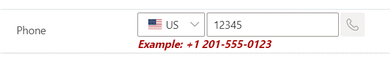
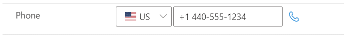

# Phone Number Format 

A PCF control using Google Phone Library to format phone numbers.  This uses the Google Phone Library npm package to format phone numbers.

### Configure the control

This control requires at least 1 field on the entity to store the Country Code.  When a record is opened it will defualt the country code to "US" but that could be changed.

### Screenshots

